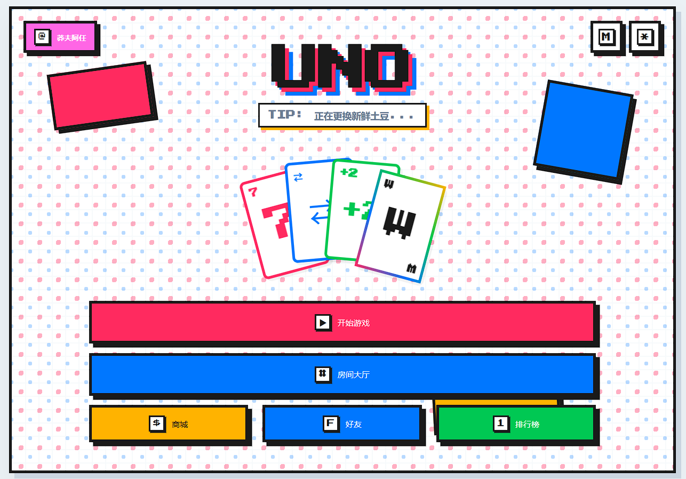

# Neo Card Party

Neo Card Party is a web-based multiplayer card game inspired by classic UNO-style gameplay. It is built as a complete full-stack example with a player-facing web client, a Node.js game server, a standalone admin console, persistent player data, and a shared TypeScript contract package.

This project is not an official UNO product and is not affiliated with any trademark owner. If you publish your own version, use an original name, logo, domain, and promotional copy.



## Highlights

- UNO-inspired card play: colors, numbers, action cards, wild cards, turn flow, and result settlement.
- Local play and online rooms, with online state owned by the server.
- Neo-brutalism visual style: thick borders, hard shadows, strong color blocks, pixel-like controls, and playful interface copy.
- Standalone admin console for testing and operating users, mail, redeem codes, ranking rewards, and other live-game data.
- Persistent account systems including player profile, coins, inventory, titles, mail, friends, and leaderboards.
- Shared contract package for frontend and backend protocol types.

## Tech Stack

- Web client: Vite, TypeScript, native DOM/CSS.
- Server: Node.js, Express, TypeScript.
- Multiplayer framework: [Colyseus](https://colyseus.io/), used for room management, WebSocket communication, and state synchronization.
- Database: MariaDB / MySQL.
- Tests: Vitest.
- Repository layout: npm-workspace-style monorepo.

## Third-Party Project Notice

This project really uses Colyseus in code:

- `apps/server/package.json` depends on `colyseus` and `@colyseus/schema`.
- `apps/web/package.json` depends on `colyseus.js`.
- The server creates a Colyseus `Server`, and game rooms extend Colyseus `Room`.
- The web client uses the Colyseus client to create, join, and reconnect online rooms.

## Repository Structure

```text
apps/
  web/       player-facing browser game
  server/    HTTP API and Colyseus real-time game server
  admin/     standalone GM/admin console
packages/
  shared/    shared protocol types and rule helpers
docs/
  images/    screenshots and documentation images
```

## Quick Start

Install dependencies:

```powershell
npm install
```

Build:

```powershell
npm run build
```

Run tests:

```powershell
npm run test
```

Start the server, web client, and admin console in separate terminals:

```powershell
npm run dev:server
npm run dev:web
npm run dev:admin
```

## Environment Variables

The root `.env.example` contains placeholder values only. Copy it into the env file required by your deployment target and replace all `change-me` and `replace-with-*` values.

Common values:

```text
VITE_API_BASE=https://api.example.com/api
VITE_WS_URL=wss://api.example.com
ADMIN_API_BASE=https://api.example.com/api
DB_NAME=card_party
DB_USER=card_party_user
DB_PASSWORD=change-me
ROOT_BOOTSTRAP_PASSWORD=change-me
```

Do not use example passwords in production, and do not commit real `.env` files.

## Documentation

- [Architecture](ARCHITECTURE.md)
- [Deployment](DEPLOYMENT.md)
- [Shared package notes](../packages/shared/README.md)
- [Shared release notes](../packages/shared/RELEASE.md)

## Public Release Notes

This public version is suitable as a learning project, portfolio project, or starting point for further development. Before publishing your own fork, review:

- Whether the project name, logo, promotional images, and domains are original.
- Whether screenshots, music, fonts, and image assets are allowed for public use.
- Whether real `.env` files, database backups, tokens, private keys, and production domains are excluded.
- Whether the admin console is protected by domain, reverse proxy, platform access control, or VPN restrictions.

## License

This public version uses the MIT License. Please review your own asset licenses, trademark strategy, and release scope before publishing.
